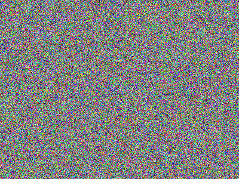

# Image Magic

This dense script can generate and perform operations on image files.

## Generation

The program can generate color or black-and-white images of any size. 

```
usage: xor_img.py gen [-h] [-c] x y Output
```

A 400x300 png image of random pixels:



## Operations

The program can perform a bitwise AND, OR, or XOR operation on two input images. 

```
usage: xor_img.py op [-h] [-o Output] File1 operation File2
```

But why would anyone in their right mind ever perform an XOR on two images? Well, to encrypt an image with a secret seed! 
